# Installing Aspera High Speed Transfer Server on Desktop

[Return to Aspera Installation labs page](../index.md)

---

# Table of Contents 
- [1. Overview](#overview)
- [2. Download Aspera High Speed Transfer Server](#hsts-download)
- [3. Installing HSTS on MAC](#hsts-install)
- [4. Install license](#hsts-license)
- [5. Running HSTS Application](#hsts-running)
- [6. Upload File](#upload-file)
- [7. Summary](#summary)

---


## 1. Overview <a name="overiew"></a>

This lab session will cover the process of installing and utilizing the IBM Aspera High Speed Transfer Server (HSTS) on your MAC. A similar procedure can be applied to install IBM Aspera HSTS on a Windows Desktop.

<br>


## 2. Downloading Aspera High Speed Transfer Server (HSTS) <a name="hsts-download"></a>

To download IBM Aspera High Speed Transfer Server [Click here](https://www.ibm.com/products/aspera/downloads)

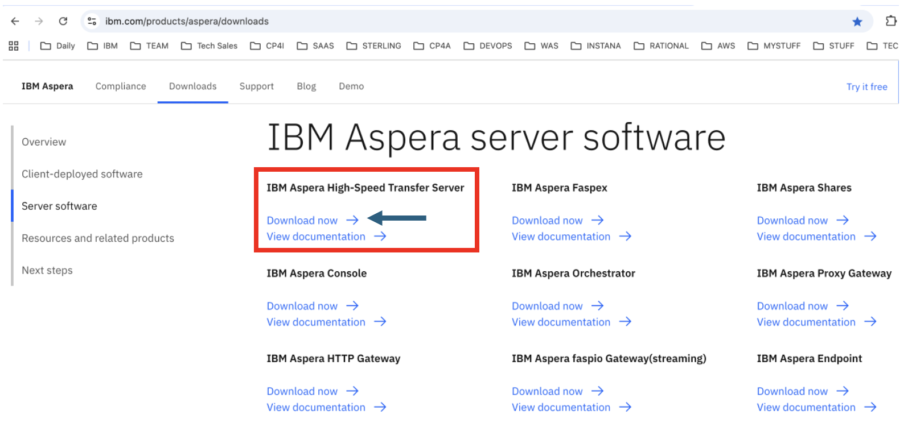

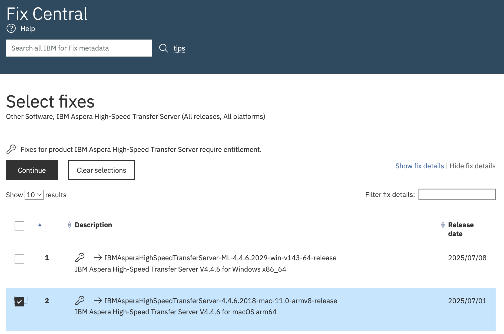

Logon using your IBM ID, and download the software. <br>

<br>


## 3. Installing HSTS on MAC <a name="hsts-install"></a>

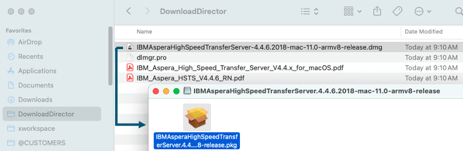

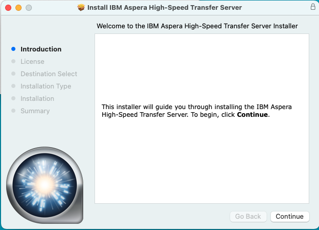

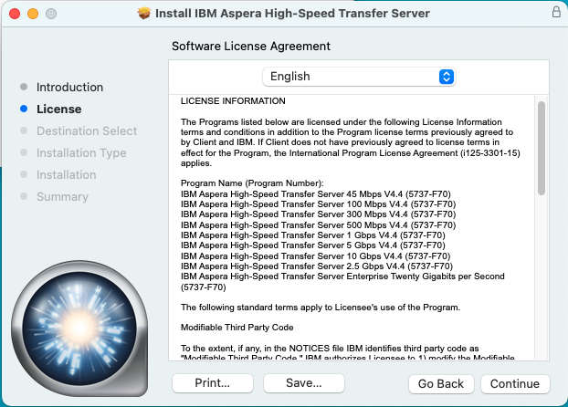

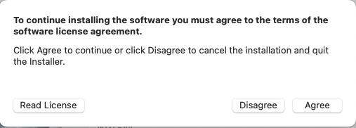

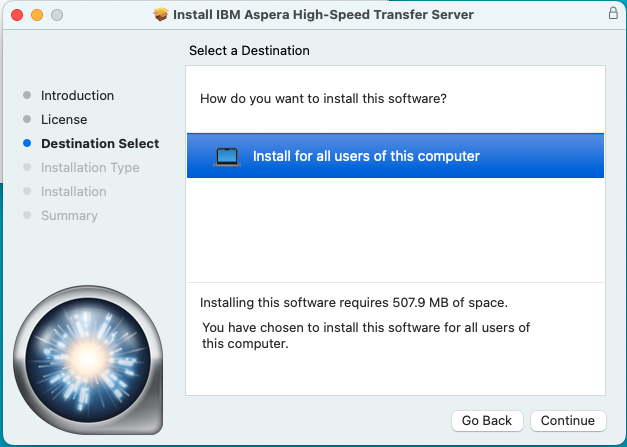

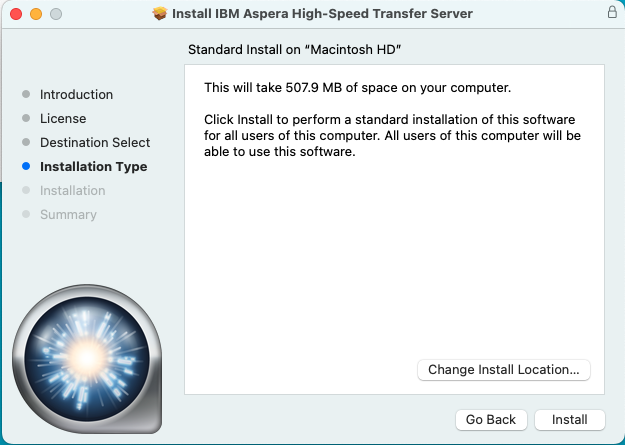

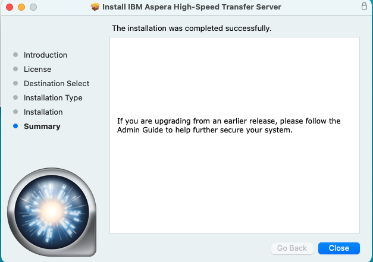

<br>

## 4. Install license <a name="hsts-license"></a>

Obtain the temporary license. <br>

Run the below command to open IBM Aspera High Speed Transfer Server Application. <br>

```
sudo --preserve-env /Applications/IBM\ Aspera\ High-Speed\ Transfer\ Server.app/Contents/MacOS/AsperaScpStub
```

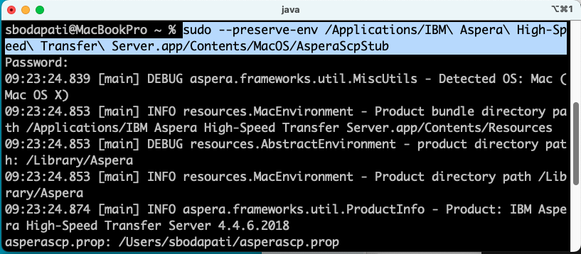

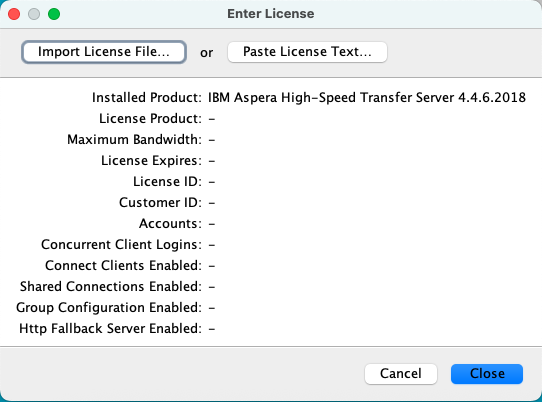

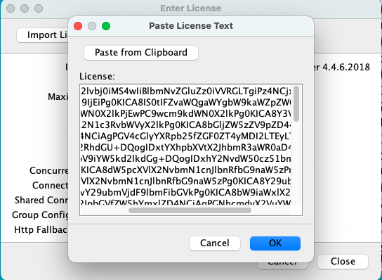

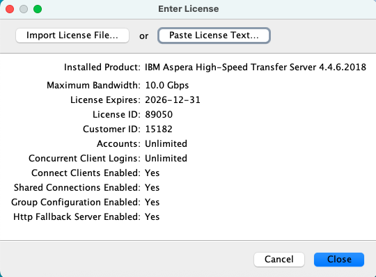

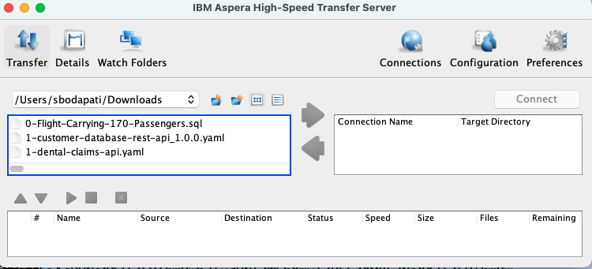

Close the Application, we will open it as normal user instead of root. <br><br>


## 5. Running HSTS Application <a name="hsts-running"></a>

Run Aspera High Speed Transfer Application as a normal use as below. <br>

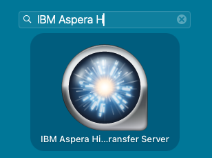

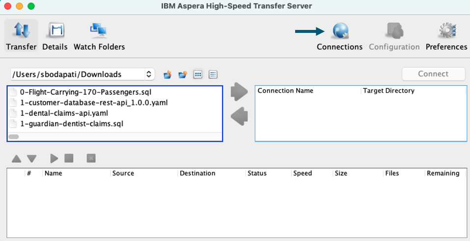

Click on Connections. <br>

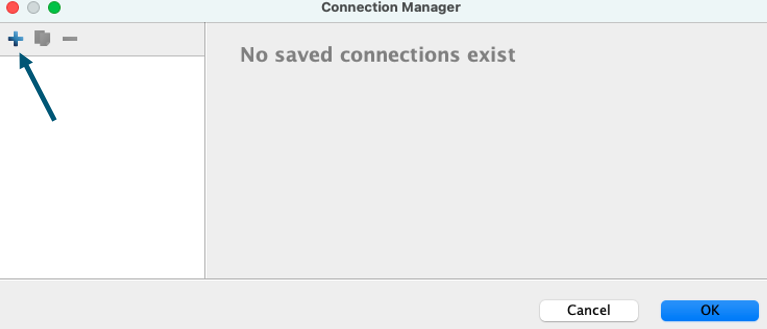

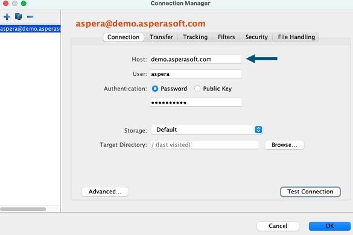

Host: demo.asperasoft.com <br>
User: aspera <br>
Password: demoaspera <br>

Click "Test Connection", and click "Ok". <br>

<br>


## 6. Upload File <a name="upload-file"></a>

Click on Preferences, and make sure the default speed is set to 1gbps. <br>

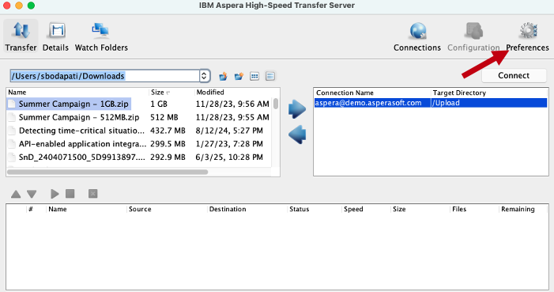


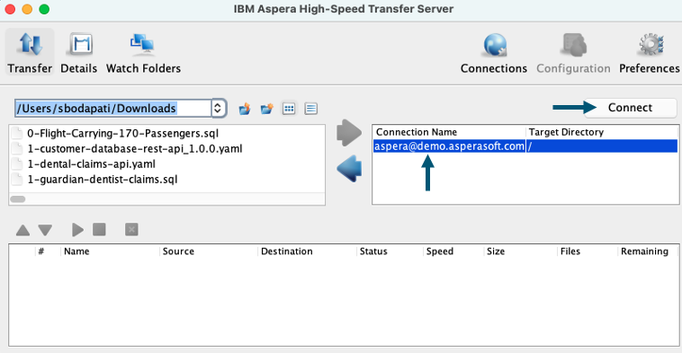

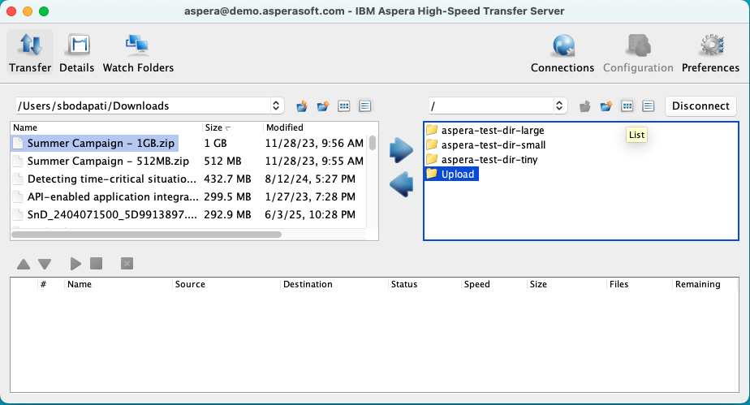

Double click on Upload directory. <br>

Select a large file from your desktop, and click on the right arrow. <br>

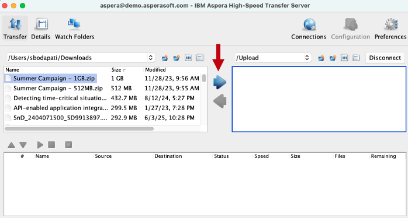


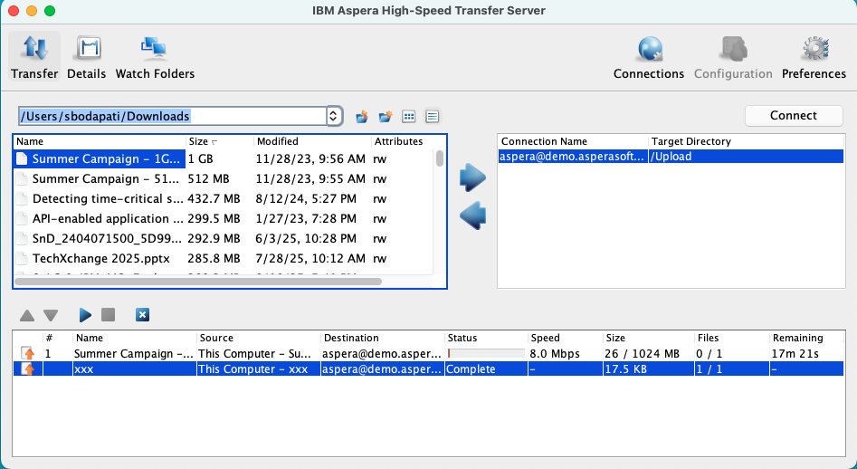

Watch the file being transferred to demo.asperasoft.com High Speed Transfer Server Upload folder. <br><br>


## 7. Summary <a name="summary"></a>

You have investigated the process of installing IBM Aspera High Speed Transfer Server on your local desktop, activated the license, and subsequently uploaded a file to utilize the High Speed Transfer Server for file uploads to another High Speed Transfer Server. <br>

<br>

### !!! End of lab !!!

<br>

Notes: <br>

**Steps to uninstall and clean Aspera HSTS on MAC.** <br>
Uninstall Aspera HSTS from /Applications<br>
**Clean cache/saved configurations**<br>
sudo rm -rf /Library/Aspera/etc/sudoers.d/asperadaemon<br>
**Remove license – we will apply later**<br>
sudo rm /Library/Aspera/etc/aspera-license<br>

<br>

[Return to Aspera Installation labs page](../index.md)


